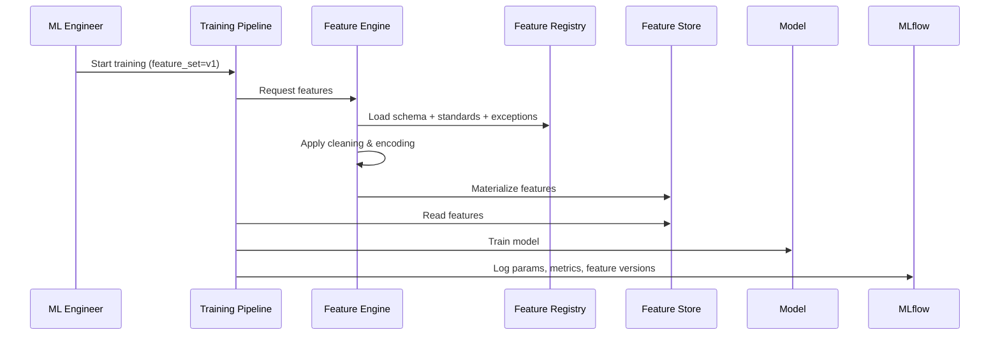

```mermaid
sequenceDiagram
    participant ME as ML Engineer
    participant TP as Training Pipeline
    participant FE as Feature Engine
    participant FR as Feature Registry
    participant FS as Feature Store
    participant M as Model
    participant MF as MLflow

    ME ->> TP: Start training (feature_set=v1)
    TP ->> FE: Request features
    FE ->> FR: Load schema + standards + exceptions
    FE ->> FE: Apply cleaning & encoding
    FE ->> FS: Materialize features
    TP ->> FS: Read features
    TP ->> M: Train model
    TP ->> MF: Log params, metrics, feature versions
```